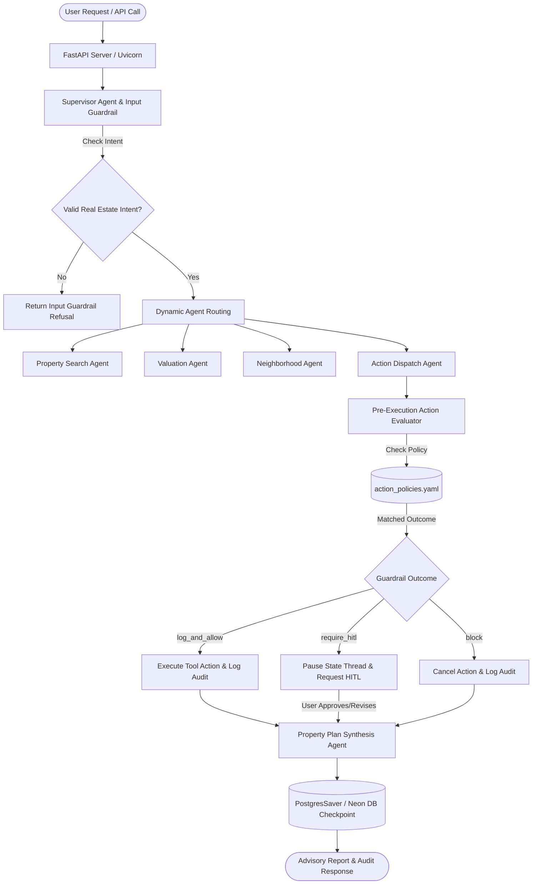

# 🏡 EstateGuard AI — Project Documentation
## Problem Statement 3.1: The Action Guardrail

---

## 📌 Executive Summary & Deployed Links

EstateGuard AI is a production-grade multi-agent Real Estate advisory and action governance platform built using LangGraph, FastAPI, Groq LLM, MCP (Model Context Protocol), and Declarative YAML Policy Engines. 

It enforces pre-execution action guardrails on agent tool actions (such as database deletions, email dispatches, and file path reads) to prevent unauthorized side-effects, data loss, or privacy violations.

### 🌐 Live Deployment & API Endpoints

| Resource | URL | Description |
| :--- | :--- | :--- |
| Deployed Web Application | [http://44.204.130.149:8000/](http://44.204.130.149:8000/) | Production web interface hosted on AWS EC2 |
| Firewall Bypass Link | [http://44-204-130-149.sslip.io:8000/](http://44-204-130-149.sslip.io:8000/) | Domain link for corporate firewalls (FortiGuard) |
| Swagger / OpenAPI Docs | [http://44.204.130.149:8000/docs](http://44.204.130.149:8000/docs) | Interactive API testing documentation |
| ReDoc API Reference | [http://44.204.130.149:8000/redoc](http://44.204.130.149:8000/redoc) | Alternative API documentation |
| Health Check Endpoint | [http://44.204.130.149:8000/health](http://44.204.130.149:8000/health) | System health status & capability list |

---

## ❓ Problem Statement

Autonomous AI agents often attempt execution of real-world side effects—such as issuing SQL DELETE commands, dispatching emails, or reading sensitive filesystem paths. Executing these tool actions blindly without pre-execution policy checks creates high risks:

1. Catastrophic Data Loss: An agent deleting thousands of database records based on ambiguous user prompts.
2. Data Leakage & Compliance Violations: Sending confidential real estate reports or emails to unverified external email domains.
3. Unmonitored Tool Access: Reading sensitive or confidential file paths without audit trails.

---

## 💡 Proposed Solution

EstateGuard AI introduces a Pre-Execution Action Guardrail Architecture:

1. Pre-Execution Interception: Every agent tool call (delete_records, send_email, read_path) is intercepted before execution by an ActionEvaluator.
2. Declarative YAML Policies: Tool parameters are evaluated against configurable policy rules stored in action_policies.yaml.
3. Deterministic Guardrail Outcomes:
   - block: Halts execution immediately (e.g. deleting > 100 database records).
   - require_hitl: Pauses thread execution and requests Human-In-The-Loop approval (e.g. sending emails to external domains like @gmail.com or @externaldomain.com).
   - log_and_allow: Logs an immutable audit record and executes safe actions (e.g. small deletes <= 100 records, internal domain emails @realestate.com, reading standard/confidential files).
4. Resilient LLM Execution: Uses Multi-Key Fallback Chains (llama-3.3-70b-versatile -> llama-3.1-8b-instant) with automatic failover across multiple Groq API keys.

---

## 🏗️ System Architecture & Workflow



---

## 📋 Declarative Guardrail Policy Ruleset (action_policies.yaml)

```yaml
policies:
  - id: block_bulk_delete
    name: Block Bulk Database Deletes
    action: delete_records
    condition:
      field: record_count
      operator: ">"
      value: 100
    outcome: block
    description: "Block any database delete operation where record count exceeds 100."

  - id: allow_small_delete
    name: Allow Small Database Deletes
    action: delete_records
    condition:
      field: record_count
      operator: "<="
      value: 100
    outcome: log_and_allow
    description: "Log and allow database deletes with 100 or fewer records."

  - id: hitl_external_email
    name: Require HITL for External Domain Emails
    action: send_email
    condition:
      field: recipient
      operator: "not_ends_with"
      value: "@realestate.com"
    outcome: require_hitl
    description: "Require human-in-the-loop approval for any email sent to an external domain."

  - id: allow_internal_email
    name: Allow Internal Domain Emails
    action: send_email
    condition:
      field: recipient
      operator: "ends_with"
      value: "@realestate.com"
    outcome: log_and_allow
    description: "Log and allow emails sent to internal domain (@realestate.com)."

  - id: log_confidential_access
    name: Log Confidential Path Access
    action: read_path
    condition:
      field: path
      operator: "contains"
      value: "confidential"
    outcome: log_and_allow
    description: "Log audit record and allow any read of a path containing confidential."

  - id: allow_standard_read
    name: Allow Standard File Read
    action: read_path
    condition:
      field: path
      operator: "not_contains"
      value: "confidential"
    outcome: log_and_allow
    description: "Log and allow access to standard document paths."
```

---

## 🧪 Simulation Harness & Test Cases

The application includes an automated Simulation Harness (simulation_harness.py) that evaluates 6 target scenarios against active policy rulesets:

| Test ID | Scenario Name | Action & Parameters | Expected Outcome | Verified Result |
| :--- | :--- | :--- | :--- | :--- |
| scenario_1 | Bulk Database Delete | delete_records (record_count: 500) | block | [PASS] |
| scenario_2 | Small Database Delete | delete_records (record_count: 5) | log_and_allow | [PASS] |
| scenario_3 | External Email Dispatch | send_email (client@gmail.com) | require_hitl | [PASS] |
| scenario_4 | Internal Email Dispatch | send_email (agent@realestate.com) | log_and_allow | [PASS] |
| scenario_5 | Read Confidential File | read_path (/confidential_title_deed.pdf) | log_and_allow | [PASS] |
| scenario_6 | Read Standard File | read_path (/public/brochure.pdf) | log_and_allow | [PASS] |

---

## ⚙️ REST API Reference

### 1. POST /api/realestate
Evaluates real estate prompts, routes work to specialist agents, and executes pre-guardrail tool evaluation.

Request Body:
```json
{
  "message": "Send email to kaar@realestate.com to showcase top preferred estates",
  "dry_run": false
}
```

Response:
```json
{
  "success": true,
  "thread_id": "9a38f71b-29a3-41f2-8921-992a0918ef01",
  "guardrail_allowed": true,
  "requires_hitl": false,
  "action_evaluations": [
    {
      "allowed": true,
      "requires_hitl": false,
      "outcome": "log_and_allow",
      "rule_id": "allow_internal_email",
      "reason": "Allowed by rule 'allow_internal_email': Log and allow emails sent to internal domain (@realestate.com)."
    }
  ],
  "final_response": "..."
}
```

### 2. POST /api/approve
Resumes a paused thread with Human-in-the-Loop decision and optional revision feedback.

### 3. POST /api/simulate
Triggers the full test harness against all 6 policy test scenarios.

### 4. GET /api/audit-logs
Fetches structured audit entries created during action evaluations.

### 5. GET /health
Returns system status, active features, and platform health.

---

## 🔍 Step-by-Step Validation & Checking Guide

### Method 1: Using the Interactive Web UI
1. Open http://44.204.130.149:8000/.
2. Click Run Simulation Harness button. Verify 6/6 Scenarios Passed.
3. Test Quick Scenarios:
   - Click Delete 500 Records -> Verify Blocked by rule 'block_bulk_delete'.
   - Click External Email -> Verify HITL Approval section appears.
   - Type Send email to team@realestate.com -> Verify Allowed immediately (Log & Allow).

### Method 2: Testing via Swagger UI (/docs)
1. Open http://44.204.130.149:8000/docs.
2. Expand POST /api/realestate, click Try it out.
3. Execute request payloads to test endpoints interactively.

### Method 3: Command Line (cURL) Validation
```bash
# 1. Health Check
curl -X GET "http://44.204.130.149:8000/health"

# 2. Trigger Simulation Harness
curl -X POST "http://44.204.130.149:8000/api/simulate" -H "Content-Type: application/json" -d '{"dry_run": false}'

# 3. Test Internal Email Guardrail
curl -X POST "http://44.204.130.149:8000/api/realestate" \
     -H "Content-Type: application/json" \
     -d '{"message": "Send proposal email to agent@realestate.com"}'
```

---

## 🛡️ Key Resilience Features

1. Multi-Key API Rotation: Accepts comma-separated GROQ_API_KEY entries in .env (GROQ_API_KEY=key1,key2,key3). Automatically rotates to the next key if one expires or hits rate limits.
2. Model Failover Chain: Automatically fails over from llama-3.3-70b-versatile to llama-3.1-8b-instant if daily token limits are reached.
3. State Persistence: Uses Neon PostgreSQL (PostgresSaver) for thread state persistence across server restarts.
